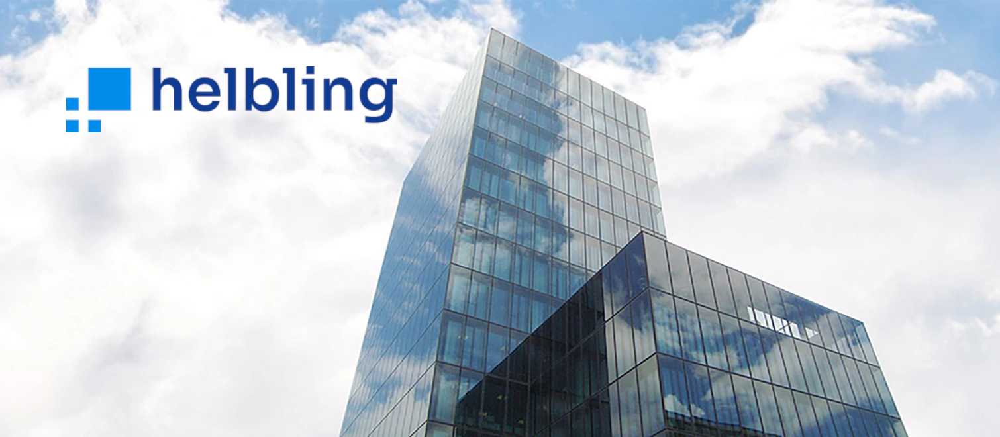

# About  

[Helbling](https://helbling.ch/en) is a globally active engineering and innovation partner supporting deep-tech product development from early ideation to industrialization with over 500 engineering specialists.
The passion for technology and problem-solving drives us to deliver cutting-edge products and services to our clients. Whether it's product design, prototyping, software development, or system integration, we excel in delivering high-quality solutions tailored to meet our clients' needs 

  

    <b>Helbling Technik AG</b>  
    Hohlstrasse 614  
    CH-8048 Zürich  
    +41 44 438 17 01  
    info-htkz@helbling.ch
  

  

    <iframe src="https://www.google.com/maps/embed?pb=!1m18!1m12!1m3!1d86432.59596213706!2d8.35221466249999!3d47.392069500000005!2m3!1f0!2f0!3f0!3m2!1i1024!2i768!4f13.1!3m3!1m2!1s0x47900bb8f5660e63%3A0x134bcb24c369ae26!2sHelbling%20Technik%20AG!5e0!3m2!1sen!2sch!4v1690287434681!5m2!1sen!2sch" width="100%" height="400" style="border:0;" allowfullscreen="" loading="lazy" referrerpolicy="no-referrer-when-downgrade"></iframe>
  

