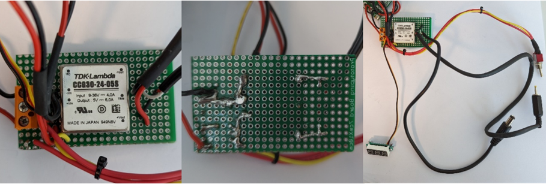
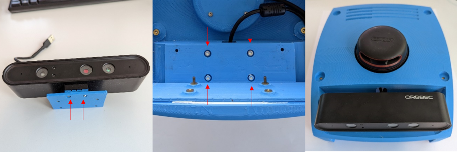

# Assembly Instructions

Do you have all the parts listed in the [Bill of Materials](../bill_of_materials) ready? Then let's get started!

## Task 1: Wheel assembly

**Assembly Time**

5 minutes / wheel

**Tools needed**

- 2 mm hex-head key
- 2.5 mm hex-head key

### Step 1: Motor

**Required Parts:**

- 1x HEL-04-01000-02 / Frame Mount (For first wheel only)
- 1x HEL-06-01009-00  / Motor
- 6x DIN 7984 - M3 x 8 --- 4.5N / Screw M3x8

Securely fix the motor into the frame mount using 6x M3x8 screws. The first motor should be attached where the frame mount does not allow for sliding in the motor (back right).

### Step 2: Wheel Adapter

**Required Parts:**

- 1x HEL-06-01002-00 / Wheel Adapter
- 1x DIN 7984 - M3 x 12 --- 10.5N / Screw M3x12 

Attach the wheel adapter to the motor assembly using 1x M3x12 screw.
Tighten the screw where the flange is flattened to stop it from rotating.

### Step 3: Wheel

**Required Parts:**

- 1x HEL-06-01000-00 / Wheel 
- 4x DIN 7984 - M3 x 8 --- 6.5N / Screw M3x8 

Fix the wheel onto the wheel adapter using 4x M3x8 screws.

**Good job! Now 3 more to go.**

This is how the assembly should look after all the wheels have been attached.

## Task 2: Chassis

**Assembly Time**

30 minutes

**Tools needed**

- 2 mm hex-head key
- 2.5 mm hex-head key
- Flat-head screwdriver
- TR9 Torx screwdriver
- 8 mm hex-head socket

### Step 1: Motor Controller Plate

**Required Parts:**

- 1x HEL-04-01009-01 / Motor Controller Plate
- 1x HEL-04-01010-01 / Top Plate
- 2x ISO 4762 M3x4 / Screw M3x4

Attach the motor controller plate to the top plate using 2x M3x4 screws.

### Step 2: IMU

**Required Parts:**

- 1x HEL-06-03003-00 / IMU
- 4x ISO 4762 M2 x 6 - 6N / Screw M2x6
- 4x Washer ISO 7092 – 2 / Washer M2

Mount the IMU using 4x M2x6 screws and 4x M2 washers.

### Step 3: Top Plate on Frame Mount
**Required Parts:**

- 4x DIN 7984 - M3 x 8 --- 6.5N / Screw M3x8

Secure the top plate to the frame mount using 4x M3x8 screws.

### Step 4: Fan on Jetson

**Required Parts:**

- 1x HEL-06-01005-00 / Fan
- 1x HEL-06-01003-00 / Jetson
- 4x ISO 14581 M2.5x16x16- / Screw M2.5x16
- 4x ISO - 4032 - M2.5 - D – N / Nut M2.5

In order to provide some cooling, install the fan on the Jetson using 4x M2.5x16 screws and 4x M2.5 nuts.

### Step 5: Mount Jetson on Top Plate

**Required Parts:**

- 1x HEL-04-03004-00 / Base Plate for Jetson
- 4x DIN 7984 - M3 x 8 --- 6.5N / Screw M3x8

Place the Base plate onto the Top Plate. Put the Jetson onto its base plate and attach both to the Top Plate using 4x M3x8 screws.

### Step 6: Mount Motor Controller

**Required Parts:**

- 2x HEL-06-01004-00 / Motor Controller Kit
- 8x Screw from Motor Controller Kit
- 1x HEL-04-01017-01 /  Holder Motorcontroller

Mount the first Motor Controller and the orange Motor Controller holder using the screws provided in the Motor Controller Kit. Attach the second Motor Controller on the Motor Controller Holder.

### Step 7: Connect Cables

**Required Parts:**

- 2x HEL-06-03005-00 / USB Cable

Connect the USB cables as shown in the image and the [Electronic System Architecture](electronic_system_architecture.md). Make sure that the encoder is connected to the right motor.

### Step 8: Battery Protection

**Required Parts:**

- 1x HEL-06-04001-00 / Battery Protection 
- 1x Battery Connector (Deans M/F)
- 1x Battery Cable (EP Silicone Cable 0.5mm²)

Solder the Battery Cables and Battery Connector to the Battery Protection Module. Use the [Electronic System Architecture](electronic_system_architecture.md) as reference.

### Step 9: DC / DC Converter

**Required Parts:**

- 1x HEL-06-03004-00 / DC/DC Converter
- 1x HEL-06-04000-00 / Prototyping Board for DC/DC Converter
- 1x HEL-06-03001-01 / LED Voltmeter 
- 1x HEL-06-03002-00 / Power Switch

Solder the connections of the DC/DC converter, LED Voltmeter, and Power Switch as shown in the image. The second image is mirrored so that you can compare it to the left image. Solder the connections according to the [Electronic System Architecture](electronic_system_architecture.md) and the Prototyping Board below.

{: style="height:89%;width:89%"}

### Step 10: Ciruit Board Box

**Required Parts:**

- HEL-04-04000-00 / Circuit Board Holder Base
- HEL-04-04001-00 / Circuit Board Holder Middle
- HEL-04-04002-00 / Circuit Board Holder Top
- 3x ISO 4762 M3 x 30 / Screw M3x30

Place the Battery Protection on the Circuit Board Holder Base. Make sure that the cables are oriented correctly so that they leave the box as shown in the image. Place the Circuit Board Holder Middle on the Battery Protection Module.

Place the Prototyping Board with the DC/DC Converter on top of the Circuit Board Holder Middle . Assemble the whole Circuit Board Holder by using the Circuit Board Holder Top and 3x M3x30 screws.

### Step 11: Voltmeter

**Required Parts:**

- 2x DIN 7985A - M2x5 /  Screw M2x5
- 2x ISO - 4032 - M2 - D – N / Nut M2

Attach the voltmeter using 2x M2x5 screws and 2x M2 nuts.

### Step 12: Power Switch

Attach the Power Switch with the 8 mm hex-head socket.

### Step 13: Connect Cables

Connect all the cables according to the [Electronic System Architecture](electronic_system_architecture.md). The cables to the battery and the one power cable to the LIDAR remain unconnected for now.

**Good job! Now lets continue with assembling the last part - the body.**

## Task 3: Body

**Assembly Time**

20 minutes 

**Tools needed**

- 2 mm hex-head key
- 2.5 mm hex-head key
- 18 mm wrench

### Step 1: Add Threaded Bushes to Body and Camera Plate

**Required Parts:**

- 1x HEL-04-03002-00 / Body
- 1x HEL-04-01013-02 / Camera Plate
- 12x Thread Insert MULTISERT 003M3 / Threaded Bush

Press the threaded bushes into the Body and Camera Plate while heating them with a soldering iron.

### Step 2: Power Supply Connector

**Required Parts:**

- 1x HEL-06-03000-00 / Power Supply Connector

Attach the Power Supply Connector to the robots body.

### Step 3: LIDAR

**Required Parts:**

- 1x HEL-06-01008-00 / LIDAR
- 1x HEL-06-01007-00 / LIDAR Adapter
- 4x DIN 7984 - M3 x 8 --- 6.5N / Screw M3x8

Mount the LIDAR on the Body using 4x M3x8 screws.

### Step 4: Camera

**Required Parts:**

- 1x HEL-06-01006-00 / Camera
- 4x DIN 7984 - M3 x 8 --- 6.5N / Screw M3x8
- 2x DIN 7984 - M3 x 12 --- 10.5N / Screw M3x12

Mount the Camera onto the Camera Plate with 2x M3x12 screws. Then attach the camera assembly to the robots body using 4x Threaded Bush and 4x M3x8 screws.

### Step 5: Merge Body and Chassis

**Required Parts:**

- 4x DIN 7984 - M3 x 18 / Screw M3x18

Attach the body onto the chassis using 4x M3x18 screws.

### Step 6: Battery Holder

**Required Parts:**

- 1x HEL-04-01004-00 / Battery Holder
- 4x DIN 7984 - M3 x 8 --- 6.5N / Screw M3x8

Mount the Battery Holder on the bottom of the Frame Mount with 4x M3x8 screws.

### Step 7: Mount Front Part

**Required Parts:**

- 1x HEL-04-03003-00 / Front Part
- 2x ISO 4762 M3 x 30 / Screw M3x30

Attach the Front Part to the Body with 2x M3x30 screws.

### Step 8: iPad Holder (optional)

**Required Parts:**

- 1x HEL-04-02001-00 / iPad Holder
- 4x ISO 4762 M3 x 40 / Screw M3x40

Optionally, an iPad Holder can be attached to HelMoRo with 4x M3x40 screws.

### Step 9: Wheel Cap (optional)

**Required Parts:**

- 4x HEL-04-03000-01 / Wheel Cap

Optionally, Wheel Caps can be attached to the wheel.

### Step 10: Fork (optional)

**Required Parts:**

- 1x HEL-04-03003-00 / Front Part with Fork
- 4x ISO 4762 M3 x 30 / Screw M3x30

Optionally, the front part can be replaced and a Fork can be added. The Fork can be attached by using 4x M3x30 screws.
