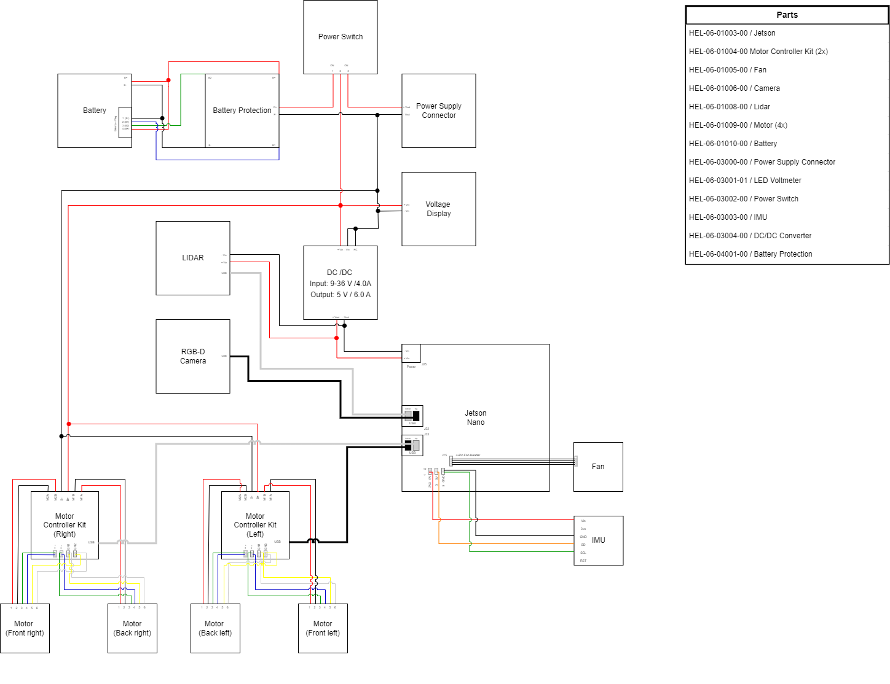

# Electronic System Architecture

This overview will provide a clear understanding of the system's components and their interconnections. The part numbers are the same as in the [Bill of Materials](bill_of_materials.md).

{: style="height:89%;width:89%"}

[Download Electronical Architecture](Helmoro_Electronical_Architecture.drawio.pdf)