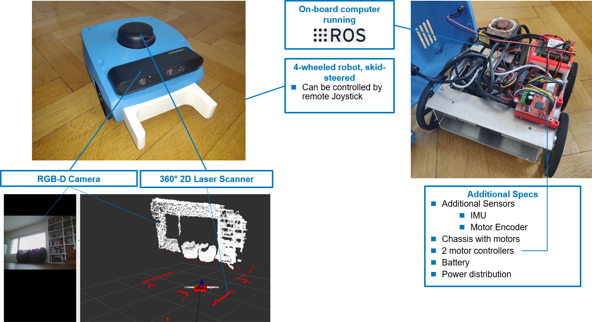

# Introduction

<iframe width="1000" height="565" src="https://www.youtube.com/embed/QdNnvhEyrZk" title="YouTube video player" frameborder="0" allow="accelerometer; autoplay; clipboard-write; encrypted-media; gyroscope; picture-in-picture; web-share" allowfullscreen></iframe>

Helmoro is a four wheeled, skid steered navigation robot, equipped with:

- 4 DC-Motors and 4 angular encoders
- 4 2 [Roboclaw Motor Controllers](https://www.basicmicro.com/Roboclaw-2x7A-Motor-Controller_p_55.html) to control their motion.
- 1 Lidar ([RPLidar Slamtec](https://www.slamtec.com/en/Lidar/A2))
- 1 RGB-D camera ([Orbbec Astra Pro](https://orbbec3d.com/product-astra-pro/))
- 1 IMU ([Adafruit BNO055 Absolut Orientation](https://learn.adafruit.com/adafruit-bno055-absolute-orientation-sensor))
- 1 [NVIDIA Jetson Nano Developer Kit](https://developer.nvidia.com/embedded/jetson-nano-developer-kit) with Ubuntu 18.04

Helmoro is developed by Helbling Technik. An overview of Helmoro's components is shown in the following model.

<iframe src="https://helbling1.autodesk360.com/shares/public/SHd38bfQT1fb47330c9913f21ef2baf79ffb?mode=embed" width="1024" height="768" allowfullscreen="true" webkitallowfullscreen="true" mozallowfullscreen="true"  frameborder="0"></iframe>

[comment]: <> ()

Helmoro has the following capabilities, which can be used also within a Gazebo simulation ([Simulation](#simulation)):

- Video, map and position streaming to local computer
- Remote joystick control
- Autonomous Navigation to set goal positions
- Object detection and autonomous pickup
- Remote controlled mapping
- Autonomous mapping
- Finger gesture as commands for Autonomous pickup [WIP]

