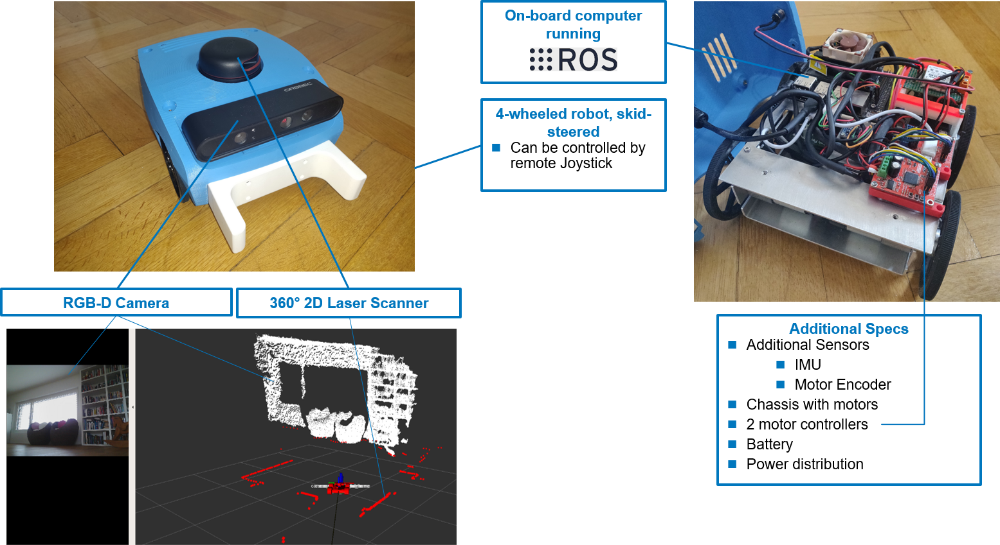

# Introduction

This section aims to explain and document the code necessary to run HelMoRo. All the relevant computation that allows Helmoro to navigate autonomously happens on board using ROS.

Helmoro is equipped with the following electronic parts:

- 4 DC-Motors and 4 angular encoders
- 4 2 [Roboclaw Motor Controllers](https://www.basicmicro.com/Roboclaw-2x7A-Motor-Controller_p_55.html) to control their motion.
- 1 Lidar ([RPLidar Slamtec](https://www.slamtec.com/en/Lidar/A2))
- 1 RGB-D camera ([Orbbec Astra Pro](https://orbbec3d.com/product-astra-pro/))
- 1 IMU ([Adafruit BNO055 Absolut Orientation](https://learn.adafruit.com/adafruit-bno055-absolute-orientation-sensor))
- 1 [NVIDIA Jetson Nano Developer Kit](https://developer.nvidia.com/embedded/jetson-nano-developer-kit) with Ubuntu 20.04

These parts allow Helmoro the following capabilities:

- Video, map and position streaming to local computer
- Remote joystick control
- Autonomous Navigation to set goal positions
- Object detection and autonomous pickup [video](pictures/Helmoro_front_pickup_big_fork_3_tries.mp4)
- Remote controlled mapping
- Autonomous mapping

These capabilities can also be used within a Gazebo [Simulation](02_quick_start_guide.md#simulation) or on the physical Robot.
