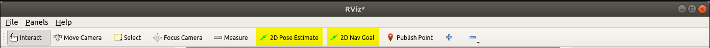

# Quick Start Guide

After setting up ROS and (in the best case) all needed repositories on your computer following the [Installation](04_installation_guide.md) you can use Helmoro. Helmoro can be run in simulation using gazebo locally on your computer or as a real robot. If you require more information and tips read chapter [Detailed Usage](03_detailed_guide.md).

## Setup

### Simulation

To run Helmoro in simulation just add

```sh
is_real_robot:=false use_rviz:=true use_gui:=true
```

to the end of the roslaunch command shown in [Launching](#launching). This will start virtual Helmoro, RVIZ, Gazebo and the joystick reader on your local computer, e.g.

```sh
roslaunch helmoro_description nav_helmoro.launch is_real_robot:=false use_rviz:=true use_gui:=true
```

which should work out of the box, if you followed the Installation guide

### Real Robot

To run the physical Helmoro you will need to set up your own computer to communicate with Helmoro. For that you first need to find out Helmoro's IP address and connect it to the same wireless network as the computer.
Connecting Helmoro to the WiFi network is easiest done by plugging the Nvidia Jetson nano to an external monitor and connecting it to the wireless network using the ubuntu gui. As you will need to know its IP address later on it is convenient to assign it a static IP such that is stays constant within the network. This can be done via the router settings and is different for each router. The general idea is to link the Jetson mac address to some static IP.

Remember both `<Your_IP>` being the IP of your linux system and `<Helmoro_IP_address>` being the IP of Helmoro in your used network. More info under [Run](03_detailed_guide.md#run).

Now you will need to set environment variables on both devices. This is either done by typing the following commands in all terminals or by adding the following to your .bashrc and thus making it permanent per machine ('nano ~/.bashrc' and paste the lines below).

```sh
export ROS_IP=<Your_IP>
export ROS_MASTER_URI=http://<Helmoro_IP_address>:11311
```

The computer additionally needs the ROS_HOSTNAME in order to run the joystick manager.

``` sh
export ROS_HOSTNAME=<Your_IP>
```

To run commands on Helmoro you will need to ssh into the NVIDIA Jetson:

```sh
ssh <username>@<Helmoro_IP_address>
```

Where `<username>` will be "helmoro" if you followed the [Installation](04_installation_guide.md) and `<Helmoro_IP_address>` being the IP of Helmoro in your used network.

<!-- After executing the desired `launch file` (see below in [Launching](#launching)) you need to run

```sh
rosrun rviz rviz -d `rospack find helmoro_description`/rviz/rviz_config.rviz
```

on your computer for visualization RVIZ.

For remote control of velocity and the commanding of autonomous object pickup the joystick:

```sh
roslaunch helmoro_joymanager joymanager.launch
```
--->

## Launching

Run these commands on Helmoro or locally depending on your desired [Setup](#setup).

### Joystick control

In the simplest case one can drive Helmoro around using the Logitech joystick. The left 'LT' and right triggers 'LT' are x-velocity and the left digital stick controls the rotation.

For this one needs to first start one of the many different launch files on Helmoro (by connecting via ssh) which also starts up the ROS Master. In the simplest case one starts the ```helmoro.launch``` which does not build a local obstacle map:

``` sh
roslaunch helmoro_description helmoro.launch
```

Secondly one needs to actually start the joystick node on the local ubuntu computer which is connected to the same network. Before doing so make sure the joystick is connected via the usb receiver to the computer.
Similarly, shift the switch to 'X' for XInput instead of 'D' for DirectInput such that floating point values will be broadcasted.
Also make sure to press the 'mode'-button such that the LED next to it lights up. This is necessary for the correct mapping of the inputs.

``` sh
roslaunch helmoro_joymanager joymanager.launch
```

Press the logitech button to wake up the controller, then press the 'LT' and 'RT' once to fully start the broadcasting of the velocity. To move forward use the 'RT' button while using the 'LT' Button to  move backwards. The left and right buttons on the left most (digital) joystick can be used to control the rotation.

### Autonomous Navigation to set goal positions

Helmoro is able to navigate in a given space using the ROS Navigation Stack avoiding static and dynamic obstacles along the calculated path. In this mode it is possible to send helmoro to goals using RVIZ and use every functionality from [joystick control](#joystick-control). You need to use Helmoro in a premapped environment. The premapped environment is set in the move ``move_base.launch`` file.
To run helmoro in new environment, first a map needs to be created with [Remote controlled mapping](#remote-controlled-mapping) or [Autonomous mapping](#autonomous-mapping)

Run the following on helmoro (connected via ssh) to launch the autonomous navigation:

```sh
roslaunch helmoro_description nav_helmoro.launch
```

Once ``nav_helmoro`` is launched one can run the following on the local machine:

``` sh
rosrun rviz rviz -d `rospack find helmoro_description`/rviz/rviz_config.rviz
```

This will start up Rviz and you can use the '2D Pose Estimate' and '2D Nav Goal' buttons to estimate its initial position and set its goal position on the map as in the image below. Make sure the checkmark for the occupancy map' is activated.



More information can be found in the chapter [Autonomous Navigation using the Navigation Stack](#autonomous-Navigation-using-the-Navigation-Stack).

### Object detection and autonomous pickup

In this mode Helmoro saves the location of objects, which he sees with his camera, in a map. The objects are displayed in RVIZ. Afterwards he can be commanded to bring the object back to a before specified location (`global goal` in `helmoro_navigation_goals/param/parameters.yaml`).  
After Helmoro detected the objects, the user can pick a color using the colored buttons on the [joystick](#joystick-control). Afterwards he can push start to command Helmoro to get the most often seen object. The back button cancels all autonomous actions from Helmoro.

```sh
roslaunch helmoro_description showcase_helmoro.launch
```

More information on the detection of object can be found in chapter [object_detector](#object_detector) and about the storage of the objects in a map in chapter [object map](#object_map).

### Remote controlled mapping

Helmoro can make use of a SLAM algorithm called gmapping, that uses the laser scans from the lidar and the odometry information coming from encoders and the IMU in order to build a map of obstacles.

```sh
roslaunch helmoro_description gmapping_helmoro.launch
```

For this to work, Helmoro can be remotely driven around by [joystick](#joystick-control) until the map is fully registered. You can follow the status in RVIZ, when looking at the `occupancy map`. When finished run in a separate terminal on Helmoro

```sh
rosrun map_server map_saver -f <location and name of your_map>
```

will save the map for later use (edit `move_base.launch` accordingly).

More detailed information can be found in [SLAM using gmapping](#slam-using-gmapping)

### Autonomous mapping

With the help of the `explore_lite` package Helmoro is able to map his environment by himself.

```sh
roslaunch helmoro_description explore_helmoro.launch
```

You can follow the status in RVIZ, when looking at the `occupancy map`. When finished run in a separate terminal on Helmoro

```sh
rosrun map_server map_saver -f <location and name of your_map>
```

will save the map for later use (edit `move_base.launch` accordingly).

More detailed information can be found in [Autonomous SLAM using explore_lite](#autonomous-SLAM-using-explore_lite)
