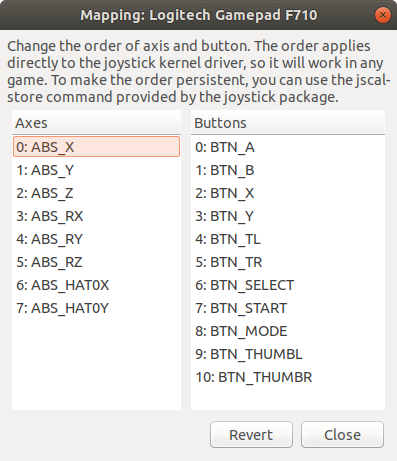

# Installation

The packages included in Helmoro support ROS Melodic on Ubuntu 18.04.

1. Install [ROS Melodic](http://wiki.ros.org/melodic/Installation) on Helmoros Nvidia Jetson and on your local machine.

2. Create a [ROS Workspace](http://wiki.ros.org/ROS/Tutorials/InstallingandConfiguringROSEnvironment)

   ```sh
   mkdir -p ~/catkin_ws/src
   cd ~/catkin_ws/
   catkin build
   source devel/setup.bash
   ```

   Either you must run the above source command each time you open a new terminal window or add it to your .bashrc file as follows

   `echo "source ~/catkin_ws/devel/setup.bash" >> ~/.bashrc`

3. Clone the repository into your catkin workspace. It is recommended to first create a new git folder, clone every required repository thereinto and thereafter create a soft link into your catkin workspace. The commands are stated in the following.
   
   ```
   sh mkdir ~/git 
   cd ~/git 
   git clone https://github.com/Helbling-Technik/HelMoRo-software.git 
   ln -s ~/git/Helmoro ~/catkin_ws/src cd ~/catkin_ws 
   ```

After that, clone the required repositories and make the required installations listed in the next section [Dependencies](#dependencies). Only after that, you can build Helmoro's internal packages using

```sh
catkin build package_name
```

## Dependencies

In the following, the packages and stacks which are required to run the Helmoro are mentioned. Do not forget to build the acquired packages once you cloned them into your workspace with the following command:

```sh
catkin build package_name
```

### Overview

- [catkin_simple](https://github.com/catkin/catkin_simple)
- any_node:
  - [message_logger](https://github.com/ANYbotics/message_logger)
  - [any_node](https://github.com/ANYbotics/any_node)
- [joystick_drivers stack](http://wiki.ros.org/joy)
- [helmoro_rplidar](https://github.com/HAJ-Helbling/Helmoro_RPLidar)
- [ros_astra_camera_helmoro](https://git.htkz.helbling.ch/HTKZ_DLE_1175_Robotik/ros_astra_camera_helmoro.git)
- [ros_imu_bno055](https://github.com/dheera/ros-imu-bno055)
- [Navigation Stack](http://wiki.ros.org/navigation)
- [gmapping](http://wiki.ros.org/gmapping)
- [explore_lite](http://wiki.ros.org/explore_lite)

Clone or download all the required repositories or stacks all together with the following commands

```sh
sudo apt-get install ros-melodic-joy
cd ~/git
git clone https://github.com/catkin/catkin_simple.git
git clone https://github.com/ANYbotics/message_logger.git
git clone https://github.com/ANYbotics/any_node.git
git clone https://github.com/HAJ-Helbling/Helmoro_RPLidar.git
git clone --branch Helmoro_2.0 https://git.htkz.helbling.ch/HTKZ_DLE_1175_Robotik/ros_astra_camera_helmoro.git
sudo apt install ros-melodic-rgbd-launch ros-melodic-libuvc
git clone https://github.com/dheera/ros-imu-bno055.git
sudo apt install ros-melodic-libuvc-camera ros-melodic-libuvc-ros
sudo apt install ros-melodic-navigation
sudo apt install ros-melodic-slam-gmapping
git clone https://github.com/hrnr/m-explore.git
```

Do not forget to link the newly acquired packages into your catkin workspace build them with the following commands:

```sh
ln -s package_name ~/catkin_ws/src
catkin build package_name
```

In order to build and run the object_detector and the hand_detector, you will need to install additional OpenCV libraries. Please see [5.11 OpenCV](#opencv) for details.

### catkin_simple

catkin_simple is a package, that simplifies the task of writing CMakeLists.txt for a package. It is used in several packages and therefore required in order for them to be built properly using `catkin build`.

### any_node

any_node is a set of wrapper packages to handle multi-threaded ROS nodes. Clone or download the following repositories into your catkin workpace:

- [message_logger](https://github.com/ANYbotics/message_logger)

- [any_node](https://github.com/ANYbotics/any_node)

### joystic_drivers stack

This stack allows a joystick to communicate with ROS. Note that the Helmoro packages work exclusively with the Logitech Wireless joystick F710controller.
Additionally to the installation, it is useful to install the joystick testing and configuration tool

```sh
sudo apt-get install jstest-gtk
```

You can test the connection of your joystick by running `jstest-gtk` from terminal. Please check the device name (Helmoro packages use default joystick name "js0"). Also ensure that the mapping of the joystick is according to this screenshot:



Ensure that you save the mapping for next time.

If your joystick has a different name eighter overwrite this value or pass your joystick name as an argument when launching the **helmoro.launch** file, which is explained in the following. To test the joystick functionality with ros run the following commands in two separate terminals:

```sh
roscore
```

```sh
rosrun joy joy_node
```

If you listen to the topic _/joy_ while using the joystick you should see the commands being published to the corresponding topic.

```sh
rostopic echo /joy
```

[joy roswiki](http://wiki.ros.org/joy)

### helmoro_rplidar

This package allows a [Slamtec RPLidar](https://www.slamtec.com/en/Lidar) to communicate with ROS. The repository has been derived from the official [rplidar_ros](https://github.com/slamtec/rplidar_ros). However, a small change in node.cpp had to be made for compatibility with the Helmoro and especially with the Navigation Stack.

The change that has been made can be found on line 61 of src/Node.cpp which now says:

```c++
scan_msg.header.stamp = ros::Time::now();
```

Instead of previously:

```c++
scan_msg.header.stamp = start;
```

Clone the [helmoro_rplidar](https://github.com/HAJ-Helbling/Helmoro_RPLidar) repository into your workspace. This will create a package, still called rplidar_ros

Before you can run the rplidar, check the authority of its serial port.

```sh
ls -l /dev |grep ttyUSB
```

To add the authority to write to it:

```sh
sudo chmod 666 /dev/ttyUSB0
```

In order to fix the rplidar port and remap it to /dev/rplidar input the following command to your terminal

```sh
~/catkin_ws/src/rplidar_ros/scripts/create_udev_rules.sh
```

Once you have remapped the rplidar USB port, change the rplidar launch files about the serial_port value.

```xml
<param name="serial_port" type="string" value="/dev/rplidar">
```

You can run the rplidar as a standalone by typing the following command into your terminal:

```sh
roslaunch rplidar_ros rplidar.launch
```

For further information, head to:

- [rplidar roswiki](http://wiki.ros.org/rplidar)
- [rplidar Tutorial](https://github.com/slamtec/rplidar_ros)

### ros_astra_camera

This package allows a [Orbbec Astra](https://orbbec3d.com/product-astra-pro) RGB-D camera to communicate with ROS. Through it, images and pointclouds coming from the camera as well as transformations between the different frames are published as topics.

Clone the [ros_astra_camera_helmoro](https://git.htkz.helbling.ch/HTKZ_DLE_1175_Robotik/ros_astra_camera_helmoro.git) repository into your workspace and install its dependencies by entering the following command into your terminal and replace `ROS_DISTRO` by the ROS distribution you are currently using (in this case `melodic`):

```sh
sudo apt install ros-$ROS_DISTRO-rgbd-launch ros-$ROS_DISTRO-libuvc ros-$ROS_DISTRO-libuvc-camera ros-$ROS_DISTRO-libuvc-ros
```

You can run the astra camera as a standalone by typing the following command into your terminal:

```sh
roslaunch astra_camera astra.launch
```

We had to fork the normal [ros_astra_camera repository](https://github.com/orbbec/ros_astra_camera), as we needed to change some small values in the tf of the camera.

### ros_imu_bno055

This repository provides a node that lets the BNO055 IMU, which is built into Helmoro, publish its fused as well as its raw data over ROS via i2c.

Clone the [ros_imu_bno055](https://github.com/dheera/ros-imu-bno055) repository into your workspace.

In order to get the imu_bno055 package to work, first check if the IMU shows up in the i2c-ports.

```sh
ls -l /dev/i2c*
```

Furthermore, check you can run

```sh
sudo i2cdetect -y -r 1
```

You should be able to see your device at address 0x28, which is the default address of the IMU BNO055.

If everything works, you can run your IMU by simply launching:

```sh
roslaunch imu_bno055 imu.launch
```

### gmapping

Gmapping is a SLAM algorithm that can be used for the task of mapping an environment using a Lidar and the robot's odometry information.

Gmapping can be installed using the following command:

```sh
sudo apt-get install ros-melodic-slam-gmapping
```

For more details about SLAM gmapping, head to section [Slam using Gmapping](06_algorithms.md#slam-using-gmapping)

### Navigation Stack

The navigation stack allows Helmoro to navigate autonomously by using the sensor data of the rplidar, astra camera and odometry.

Install the navigation stack by typing the following command into your terminal:

```sh
sudo apt-get install ros-melodic-navigation
```

For more details about SLAM gmapping, head to section [Autonomous Navigation using the Navigation Stack](06_algorithms.md#autonomous-navigation-using-the-navigation-stack)

### explore_lite

In order to let Helmoro map its environment autonomously, you can make use of the explore_lite package.

Clone the [explore_lite](https://github.com/hrnr/m-explore) repository into your workspace.

For more details about explore_lite, head to section [Autonomous Slam using explore_lite](06_algorithms.md#autonomous-slam-using-explore_lite)

### OpenCV

#### Background

The Jetson Nano's default software repository contains a pre-compiled OpenCV 4.1 library (can be installed using `sudo apt install ...`).

The pre-compiled ROS tools all use OpenCV 3.2 (if ROS is installed using `sudo apt install ...`). If a custom ROS node uses OpenCV, it will use OpenCV 4.1 when being compiled, and is thus not compatible with other ROS tools/nodes (you might be lucky, but the object_detector uses incompatible OpenCV functions). It is thus required to install OpenCV 3.2 on the Jetson Nano, and since no pre-compiled library of OpenCV 3.2 for the Jetson Nano exists, this must be done from source.

Google's mediapipe uses OpenCV 4, and it is straightforward to compile the hand_detector node. However, GPU support is not enabled in the pre-compiled OpenCV 4.1 library. Hence, the OpenCV 4.1 library must also be installed from source if the hand_detector node should run on the GPU (recommended).

#### Installing OpenCV 3.2 or 4

1. Create a temporary directory, and switch to it:
   `mkdir ~/opencv_build && cd ~/opencv_build`
2. Download the sources for OpenCV 3.2 or OpenCV 4 (any version > 4 should work) into `~/opencv_build`. You will need both `opencv` and `opencv_contrib` packages. The source files can be downloaded under the following links: [opencv](https://github.com/opencv/opencv/releases), [opencv_contrib](https://github.com/opencv/opencv_contrib/releases).
3. Make a temporary build directory and unzip the folders in your build directory. The folder structure should look like this:

```sh
~/opencv_build/
~/opencv_build/opencv/
~/opencv_build/opencv_contrib/
```

4. Create a build directory, and switch to it:

```sh
cd ~/opencv_build/opencv
mkdir build && cd build
```

5. Set up the OpenCV build with CMake. For a basic installation:

```sh
cmake -D CMAKE_BUILD_TYPE=RELEASE \
    -D CMAKE_INSTALL_PREFIX=/usr/local \
    -D INSTALL_C_EXAMPLES=ON \
    -D INSTALL_PYTHON_EXAMPLES=ON \
    -D OPENCV_GENERATE_PKGCONFIG=ON \
    -D OPENCV_EXTRA_MODULES_PATH=~/opencv_build/opencv_contrib/modules \
    -D BUILD_EXAMPLES=ON ..
```

To configure your OpenCV build more easily, install a CMake GUI, `sudo apt install cmake-qt-gui` or `sudo apt install cmake-curses-gui` and run it with `cmake-gui`.
To run the hand_detector on GPU, which is based on Google's mediapipe, you need to configure your OpenCV build to support CUDA/GPU.

6. Start the compilation process:

```sh
make -j8
```

Modify the `-j` according to the number of cores of your processor. If you don't know the number of cores, type `nproc` in your terminal.

The compilation will take a lot of time. Go grab a coffee and watch some classic [youtube videos](https://www.watson.ch/spass/youtube/278020811-die-21-besten-viralen-videos-der-schweiz).

7. To verify whether OpenCV has been installed successfully, type the following command.

```sh
pkg-config --modversion opencv4
```

(adjust the command for `opencv3`, `opencv2`, ...).
