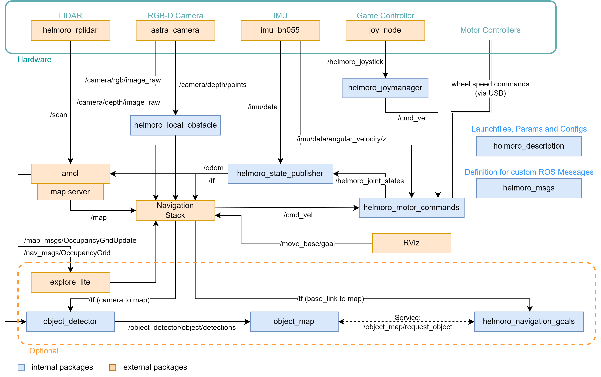
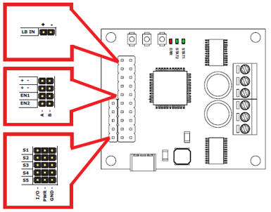

# Architectural Overview

The following flowchart shows an overview of the ROS architecture of Helmoro including internal and external packages when the parameter `is_real_robot` is set to true and gazebo is not running. The internal packages will be briefly explained in section [Packages](#packages). External Packages will be explained in section [Dependencies](#dependencies). Additionally, packages used for [SLAM](#slam-using-gmapping) (gmapping), [Autonomous Navigation](#autonomous-navigation-using-the-navigation-stack) (Nav Stack) and [Autonomous SLAM](#autonomous-slam-using-explore_lite) (explore_lite) are further explained in their respective sections.



# Packages

In the following, each package of the Helmoro ROS architecture is explained shortly.

## helmoro_description

### launch files

- helmoro.launch: Main launch file, that starts all the required nodes for Helmoro.
- gmapping_helmoro.launch: Launch file for gmapping (for customizable parameters).

### param

- default.yaml stores Helmoro's hardware specs and is used by many different nodes.

### urdf and meshes

- Meshes and .urdf files are used for the physical description of Helmoro. They define orientation and position of the different hardware components to each other. This is used to build a robot model, that can be visualized in rviz, for tf information of the different frames that are published to `/tf` using helmoro_state_publisher and for the specification of the sensor streams that should be simulated in gazebo.

### rviz

- rviz_config.rviz: rviz config file, that describes the default rviz settings for Helmoro.

<!-- ## helmoro_msgs -->

Package where all the required custom messages and services for Helmoro are described.

## helmoro_joymanager

### launch files

- joymanager.launch: Calls the two nodes joy_node (remapped as helmoro_joystick) and helmoro_joymanager and loads the parameters described in parameters.yaml

### nodes

- joy_node: interprets the joystick commands coming from the Logitech Wireless joystick F710 controller and publishes them over a message of type [sensor_msgs/Joy](http://docs.ros.org/melodic/api/sensor_msgs/html/msg/Joy.html) to the topic `/helmoro_joystick`
- helmoro_joymanager_node: Subscribes to the `/helmoro_joystick` topic, scales the joystick commands and publishes a message of type [geometry_msgs/Twist](https://docs.ros.org/api/geometry_msgs/html/msg/Twist.html) on the topic `/cmd_vel` describing the desired linear and angular movement of the Helmoro.

## helmoro_motor_commands

The helmoro_motor_commands package is only used if `is_real_robot` is set to true and used for sending desired speed commands to the motor controllers and reading out the angular speeds and position coming from the encoders. Information on the setup of the RoboClaw Motor Controllers can be found here:

<center>



</center>

|         | Option 1                                                                                                                                                                                                                                                                                                                                                                                                                                                                                                                                                                                                                                                                                                               | Option 2                                                                                                                                                                                                                                                                                                                                                                                                                                                                                                                                                                                                                                                                                                         |
| :------ | :--------------------------------------------------------------------------------------------------------------------------------------------------------------------------------------------------------------------------------------------------------------------------------------------------------------------------------------------------------------------------------------------------------------------------------------------------------------------------------------------------------------------------------------------------------------------------------------------------------------------------------------------------------------------------------------------------------------------- | :--------------------------------------------------------------------------------------------------------------------------------------------------------------------------------------------------------------------------------------------------------------------------------------------------------------------------------------------------------------------------------------------------------------------------------------------------------------------------------------------------------------------------------------------------------------------------------------------------------------------------------------------------------------------------------------------------------------- |
| Wiring  | - Wire one of the two RoboClaws to the Jetson Nano SBC via Micro-USB to Micro-USB cable <br>- Wire the second RoboClaw to the first with UART. Don’t forget to connect the Ground and to Switch RX and TX. <br>- RoboClaw: RX on S1 pin, TX on S2 pin                                                                                                                                                                                                                                                                                                                                                                                                                                                                  | - Wire both RoboClaws to the Jetson Nano SBC via Micro-USB to Micro-USB cable                                                                                                                                                                                                                                                                                                                                                                                                                                                                                                                                                                                                                                    |
| Setting | - Connect one RoboClaw to PC via USB and open it with the [downloaded BasicmicroMotionStudio](https://www.basicmicro.com/downloads) <br>- Set first RoboClaw to USB-TTL Relay Mode in the General Settings <br>- Leave second RoboClaw as it is. No Multi-Unit Mode! <br>- Set a unique address for each RoboClaws in the General Settings in order for them not to conflict with each other <br>- Set Baudrate you would like to use in the General Settings <br>- [Configure the PID values](https://resources.basicmicro.com/auto-tuning-with-motion-studio) of the RoboClaws if not yet done. <br>- Don’t forget to Device $\rightarrow$ Write Settings in the top left corner before disconnecting your RoboClaw. | - Connect one RoboClaw to PC via USB and open it with the [downloaded BasicmicroMotionStudio](https://www.basicmicro.com/downloads) <br>- Don’t set any of the two RoboClaws to USB-TTL Relay Mode <br>- Set an address for each RoboClaw in the General Settings. Note for this wiring, the addresses can be equal since ports are different (/dev/ttyACM0 and /dev/ttyACM1 in Linux) <br>- Set Baudrate you would like to use in the General Settings <br>- [Configure the PID values](https://resources.basicmicro.com/auto-tuning-with-motion-studio)] of the RoboClaws if not yet done. <br>- Don’t forget to Device $\rightarrow$ Write Settings in the top left corner before disconnecting your RoboClaw |

### nodes

- helmoro_motor_commands: Subscribes to `/cmd_vel` and `/imu/data` and computes the desired wheel speed using a straight forward computation and an integral term that sums up the error between the desired and actual (imu measured) angular speed of Helmoro's base. It sends the computed speeds to the two motor controllers and in turn reads the wheel speeds and positions and publishes them as a custom message on `/helmoro_joint_states`. Messages are sent and read from the motor controllers using the functions defined under motor_interface. They actually imitate the functions from the [RoboClaw Python Library](https://resources.basicmicro.com/using-the-roboclaw-python-library/) for C++ usage. (see `motor_command_types.h` for the according command numbers and compare them to the numbers used in the python library or in `helmoro_roboclaw`).

### comments

- In order for commands to be sent and received at a high baudrate (such as the currently set value of 115200), both roboclaw motor controllers need to be connected to the Jetson Nano by USB since bits cannot be sent over serial connections at such a high rate without errors occurring in the data transmission process. If you want to cable your motor controllers differently, you can connect a USB cable to one of the two motor controllers and connect the second to the first via UART (remember to adjust the first Roboclaw motor controller to be in USB-TTL relay mode in the BasicMicro Motion Studio). For that setting however, the baudrate needs to be set to a lower value such as 38400 for the messages not to turn out erroneous. Bear in mind, that then the individual motor_interface functions will require more time and therefore the node might not be able to run at the same rate anymore, which then needs to be adjusted. Also, if you want to change to this setting, you will need to adjust the node so that only one motor_interface instance with one portname is created and only the address is varied to communicate with the left and right motor controller.

### troubleshooting

In case you are getting errors from this package and the Roboclaw Motor Controllers are not working, go through the following quick checks:

1. Check if the port name of both Roboclaws appear when plugin in, the USB by typing `ls /dev/ttyACM*`
2. Check if you have the authority to write to this port. Otherwise type `chmod 666 <portname>` in order to add the authority.
3. Also, when using this node with two USB cables, it can happen that the portnames of the left and the right roboclaw motor controller swap (`/dev/ttyACM0` <-> `/dev/ttyACM1`). Since, to this point their USB ports are not fixed. If this happens, simply swap the two addresses for the left and the right controller specified in the param file.

## helmoro_gazebo_plugin

This package is only used, when the argument `is_real_robot` in helmoro.launch is set to false. Package that is used to run the gazebo simulation.

### nodes

- helmoro_gazebo_plugin: Custom gazebo-plugin for the Helmoro, which simulates the wheel ground interaction.

### worlds

Built worlds in which gazebo simulation can be started.

## helmoro_state_publisher

### nodes

- helmoro_state_publisher_node: Subscribes to `/helmoro_joint_states` and `/imu/data` coming from an imu package called [imu_bno055](#ros_imu_bno055) (described under dependencies). The node computes the Helmoro odometry thereof and publishes it as a message of type [nav_msgs::Odometry](http://docs.ros.org/melodic/api/nav_msgs/html/msg/Odometry.html) onto the `/odom` and onto `/tf`. It also publishes the static transforms, defined in helmoro_description/urdf and the wheel positions of Helmoro onto `/tf`.

## helmoro_local_obstacle

### nodes

- helmoro_local_obstacle_node: Subscribes to the `/camera/depth/points` topic of message type [sensor_msgs/PointCloud2](http://docs.ros.org/melodic/api/sensor_msgs/html/msg/PointCloud2.html) coming from the [astra_camera](#ros_astra_camera) package which is described below. The node simply downsamples the incoming pointcloud using a VoxelGrid filter and publishes it as `/pointcloud_filtered`.

## helmoro_2dnav

This package holds all the used launch and parameter files for the custom usage of the Navigation Stack with Helmoro. For more information, head to Navstack section.

## object_detector

### Description

Helmoro can detect coloured cubic objects and locate them using its RGB-D camera Once detected, the location of these objects is saved into a map, so that they can be targeted by the navigation stack. The object_detector looks for colored boxes in an image and outputs their 3D position in the map frame. (included in showcase_helmoro.launch)

### Limitations

Since the object detection algorithm used mainly checks for colours, the lighting conditions strongly influence the performance of this task.

### nodes

- object_detector: Subscribes to `/camera/rgb/camera_info` for the camera intrinsics, `/camera/rgb/image_raw` for the color image to find the objects, `/camera/depth/image_raw` for the depth information when objects in the color image were found. Publishes a custom message to `object_detector/object_detections` that contains all found objects in the current image, their color and their 3D position in the map frame. For debugging purposes, an image is published to `object_detector/object_detections_image` that indicates with black dots all the objects that were found. 
You can have a look at it using 'rqt_image_view'.
  ```sh
  rosrun rqt_image_view rqt_image_view
  ```

## object_map

The object_map maintains a map of all detected objects. If a detection is made close to a previous detection, it fuses both measurements instead of creating a new one. The distance under which this happens is configurable in the parameter file. All objects in the map are assigned a unique identification number such that it one can easily refer to a specific object. It publishes a service, where it sends the most often seen object from a specific colour to the requester (`/object_map/request_object`) and a service with which it is possible to edit (currently only delete) a specific object (`/object_map/edit_map`).

### nodes

- object_map: Subscribes to `/object_detector/object_detections` for all current object detections. All objects are put in a map and assigned a unique id. If the object already exists, its position is updated using a filter. It publishes a service, where it sends the most often seen object from a specific colour to the requester (`/object_map/request_object`) and a service with which it is possible to edit (currently only delete) a specific object (`/object_map/edit_map`).

### comments

- The object map keeps track of the certainty of an object in an absolute way, meaning it tracks how often a specific object was send by the object_detector.
- In the current implementation, objects are never automatically removed from the map. One could think of removing objects if the Helmoro looks at an object for a long time, but does not see it.

## helmoro_navigation_goals

This package is used for sending navigation goals to the navigation stack based on the location of the detected objects from the object map. (included in showcase_helmoro.launch)

### nodes

- helmoro_navigation_goals: Requests new objects (with their location) from the map via a rosservice `/object_map/request_object` (type `RequestObjectFromMap.srv`) and commands the robot to collect them. It does that, by going through a simple State machine and sending the computed goals to the navigation stack using \_actionlib* (as described on this [ROS wiki](http://wiki.ros.org/navigation/Tutorials/SendingSimpleGoals)).
- The task to collect the objects after they are added to the map can be started by pushing the `start` button on the joystick controller.
- At all times, during the object collection task the `back` button on the joystick controller can be used to cancel the collection of the objects and the following of the trajectories.
- When Helmoro is prepared to pick up the object, this node requests the deletion of the collected object from the map with the ros service `/object_map/edit_map` (type: `EditObjectMap.srv`).
- When Helmoro picks the object up, he changes his minimum forward speed (`min_vel_x`) to a positive value (configurable). Like this it is ensured, that Helmoro does not drive backwards or rotates in place, as this could lead to the loss of the object. He also edits his own goal acceptance tolerance to ensure no endless rotations at the global_goal by changing `xy_goal_tolerance`(configurable). When Helmoro reaches the global goal and delivered the object he then reverts both values to their original value to be able to navigate normally. (The original values is configured in the param file of the DWAPlanner).
- Helmoro has two ways how to pick up an object. This can be specified by selection `target_mode` in the parameter file.
  - Target mode 1: Helmoro drives around the object and turns behind it. He then pushes it to the global_goal.
  - Target mode 2: Helmoro drives straight on to the object and then turns with it.