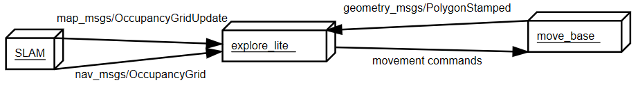

# High Level Algorithms

## SLAM using gmapping

Gmapping is a SLAM algorithm that can be used to generate a global map that can be used in autonomous navigation. It requires a horizontally fixed laser range finder(lidar) and subscribes to the `/scan` topic. Further it subscribes to `/tf` needing to know the transform between the lidar and the base_link and between the base_link and odom. In turn, it provides the transform between odom and the map frame to `/tf` and publishes the constantly updated map under the `/map` topic.

### Run

To create a map launch your helmoro in the desired environment (in gazebo or in real life)

```sh
roslaunch helmoro_description helmoro.launch
```

Open up a new terminal and enter

```sh
rosrun gmapping slam_gmapping scan:=scan
```

While this node is running drive around with your helmoro in the environment. This node will create a occupancy map using SLAM. When you are done driving around leave all the terminals running, open up a new one and enter

```sh
rosrun map_server map_saver -f <location and name of your_map>
```

This will create a your_map.pgm and your_map.yaml file at the location you defined. If you wish to use this map in navstack move it to the folder from which you call the maps and change the name of the map.yaml file in move_base.launch to your_map.yaml.

If you want to launch all commands together, you can just type

```sh
roslaunch helmoro_description gmapping_helmoro.launch
```

However, calling this custom launch file, you still need to run

```sh
rosrun map_server map_saver -f <location and name of your_map>
```

when you're finished.

### Configuration

Gmapping can be customized using parameters. The launch file **gmapping.launch**, which is saved under _helmoro_description/launch/gmapping_ calls the gmapping node with customized parameters for Helmoro. **helmoro_gmapping.launch** in turn calls **gmapping.launch** together with **helmoro.launch**.

### Limitations:

The gmapping algorithm only takes uses laser scan data coming from a horizontally mounted lidar. The RGB-D camera cannot be used for this task. Therefore, only objects that cross the "detection-plane" height of the lidar will be noticed. Also, highly reflective or transparent objects will not be detected properly using a lidar and will therefore not be written into the map.

### Troubleshooting

A problem often encountered when mapping feature poor environments such as long hallways, is that when driving the robot forward, it can skip back to the place it was before on the map since to gmapping, the features look alike. For this problem, it is advised to tweak the parameters so that gmapping puts more trust into the odometry information it gets. Have a look at [Bad maps produced by gmapping](https://answers.ros.org/question/189159/bad-maps-produced-by-gmapping-in-simulation-with-feature-poor-environments/) and [Repeated sideways jumps](https://answers.ros.org/question/193756/repeated-sideways-jumps-in-gmapping-with-hokuyo/) on ROS answer for further discussion on the topic.

For further information on the usage of gmapping head to: [gmapping ROS Wiki](http://wiki.ros.org/gmapping) and [slam_gmapping Tutorial](http://wiki.ros.org/slam_gmapping/Tutorials/MappingFromLoggedData)

## Autonomous Navigation using the Navigation Stack

72-autonomous-navigation-using-the-navigation-stack
For a good overview and detailed description head to:
[Navigation Stack ROS wiki](http://wiki.ros.org/navigation) and [Robot Setup](http://wiki.ros.org/navigation/Tutorials/RobotSetup)

### Concept

The following image shows a conceptual flowchart of the Navigation Stack. Note that the stack subscribes to exactly the blue topics that are provided by Helmoro.


In short, a global goal (`/move_base_simple/goal`) can be sent to the navigation stack, which is interpreted by the global_planner. Taking into account information from the local and global costmap it will generate a path from the robot's current position to the global goal. This path is then interpreted by the local planner, which in turn publishes the movement command for the robot.

#### move_base

[move_base](http://wiki.ros.org/move_base) controls the different packages needed for autonomous navigation including a global and a local_costmap depending on [costmap_2d](http://wiki.ros.org/costmap_2d), a [global](http://wiki.ros.org/global_planner?distro=melodic) and a [local_planner](http://wiki.ros.org/base_local_planner?distro=melodic) and recovery behaviors. All the used packages for the navigation stack can be individually tuned using parameters. Refer to the links of the individual packages for further information.

#### map_server

If you want to hand over a global map to the Navigation Stack (created by gmapping), you can use the map_server by handing over the yaml file for the map you want to hand over. Note that the yaml file describes the location of the pgm file of your map.

#### AMCL

AMCL, short for Adaptive Monte Carlo Localization, takes in laser scans, odometry, tf and map provided by the map server and computes a pose estimate of the base_link w.r.t. the global map frame and publishes it onto `amcl_pose` and `/tf` topics. To do so, AMCL constantly compares information from the robot's odometry and the alignment of the laser scans with the global map. AMCL can be finetuned using parameters. For further information on AMCL, head to the [AMCL ROS wiki](http://wiki.ros.org/amcl).

### Configuration for Helmoro

The internal package helmoro_2dnav includes all the launch and parameter files used to for the specific application of the navigation stack to Helmoro.

The main launch file is ``move_base.launch``, which calls all the actions needed and reads in the parameters specified in the different parameter files.
It calls move_base:

```xml
<node pkg="move_base" type="move_base" respawn="false" name="move_base" output="screen">
```

as well as the map_server:

```xml
<node name="map_server" pkg="map_server" type="map_server" args="$(find helmoro_2dnav)/helmoro_maps/mymap.yaml"/>
```

and AMCL:

```xml
<include file="$(find helmoro_2dnav)/amcl_helmoro.launch" />
```

Further, the parameters used for Helmoro are specified in the following files:

- common_costmap_params: parameters for both local and global costmap
- local_costmap_params: parameters for the local costmap
- global_costmap_params: parameters for the global costmap
- base_local_planner_params: parameters for the local planner
- global_planner_params: parameters for the global planner

In addition, all maps used for the map server are saved in the folder _helmoro_2dnav/helmoro_maps_.

### Run

To run the navigation stack either set the value in the helmoro.launch file of 'use_nav_stack' to 'true' or type the following command into your terminal:
you can either call **helmoro.launch** and **move_base.launch** seperately:

```sh
roslaunch helmoro_description helmoro.launch
roslaunch helmoro_2dnav move_base.launch
```

or simply launch **nav_helmoro.launch**, which calls both above launch files together.

```sh
roslaunch helmoro_description nav_helmoro.launch
```

The navigation stack is easiest used in combination with RViZ where the different maps and paths of Helmoro's world can be visualized. You can send a goal using the `2D Nav Goal` button or place Helmoro at a distinct position in your map with the `2D Pose Estimate` button.
The settings to visualize the aspects of the navigation stack are saved in the default rviz config file under _helmoro_description/rviz/rviz_config.rviz_
Head to [Nav Stack with RViz](http://wiki.ros.org/navigation/Tutorials/Using%20rviz%20with%20the%20Navigation%20Stack) for further documentation on this topic.

You can also send goals and pose estimates directly in the terminal by typing:

```sh
rostopic pub -1 /move_base_simple/goal
```

or

```sh
rostopic pub -1 /initialpose
```

and tab-complete respectively.

If you repeatedly want to start Helmoro from the same position in your map and only want to go through the task of setting a matching map position for Helmoro in RViZ once, it's a good practise to first listen to the topic `/intitialpose` (`rostopic echo /initialpose`) in order to acquire the coordinates and to be able to set them through the terminal for the next start.

Another option to specify the start position of Helmoro is to specify it in the parameters `initial_pose_x`, `initial_pose_y` and `initial_pose_a` for AMCL. Currently, a launch file called **amcl_helmoro.launch** is called in **move_base.launch** as described in [configuration for helmoro](#configuration-for-helmoro).

In order to let Helmoro localize itself, you can use the `/global_localization` service offered by AMCL by typing:

```sh
rosservice call /global_localization "{}"
```

If Helmoro gets stuck and can't find a way out because of so called ghost objects (objects marked that are actually free space), try the following rosservice call:

```sh
rosservice call /move_base/clear_costmaps
```

For reference on this call, have a look at the following [ROS Answers](https://answers.ros.org/question/267485/local_costmap-ghost-objects-restarting-move_base/)

### Tuning the Navigation Stack

As mentioned above, the each functionality of the navigation stack can be finetuned using parameters. In the following, some suggestions and findings, that where made when tuning nav stack for Helmoro, on how to tune the parameters for the different functionalities are given. In addition, some useful links for tuning and troubleshooting the navigation stack are provided at the end of this subsection.

TIP: A lot of the parameters of the navigation stack are dynamically tunable. When you run 

``` sh
rosrun rqt_reconfigure rqt_reconfigure
```

while your robot is running you can change many values dynamically in runtime.

#### Costmaps in General

Both the local costmap and the global costmaps are two map types derived from [costmap_2d](http://wiki.ros.org/costmap_2d), which provides a configurable structure that maintains information about where the robot should navigate in the form of an occupancy grid. The difference between the two is that the global costmap is seeded with a user-generated static map (map server) and the local costmap has a specified width and height which keeps the robot centered inside it.

The costmaps can be configured using plugins for the different layers. The most commonly used layers are the static_layer (for the global costmap), the obstacle layer (tracks obstacles), inflation layer (lays inflation around obstacles). Obviously, the static layer should only be present in the global costmap. The local costmap in turn should have the parameter "rolling window" set to true. Have a look at global_costmap_params and local_costmap_params.

#### common_costmap_params

important obstacle_layer parameters:

- `max_obstacle_height`): The maximum height of any obstacle to be inserted into the costmap in meters. This parameter should be set to be slightly higher than the height of your robot. Can be over-ridden on a per-sensor basis.
- `obstacle_range`: Maximum distance from the robot at which an obstacle will be inserted into the cost map in meters. Can be over-ridden on a per-sensor basis. Have a look at the sensor specs to define this parameter.
- `raytrace_range`: The default range in meters at which to raytrace out obstacles from the map using sensor data. Set this parameter to a slightly higher value than obstacle_range to avoid ghost objects. Have a look at the sensor specs to define this parameter.

Further, you can define several sensor sources that are taken into account such as our rgb-d camera and lidar which in turn are configurable. Note that is important to set the parameter `inf_is_valid` to true for our lidar. The rplidar returns inf for invalid measurements for example when there is no object where the laser beam can reflect on in its range. This parameter will help raytrace objects from the costmap even if the laser beam is not reflected properly in a certain direction.

important inflation_layer parameters:

- `inflation_radius`: radius in meters to which the map inflates obstacle cost values. This parameter should be bigger that the circumscribed radius of the robot in order to guarantee robust navigation.
- `cost_scaling_factor`: rate ad which the exponential decay function of cost values away from an object drops. A higher value for this parameter will result in decreased cost values.

#### base_local_planner_params

Velocity and Acceleration:
It is important to set the minimal velocities to a value that lets Helmoro overcome friction and the maximal velocities so that Helmoro is able to reach them.
The easiest way to find the mathcing values for these parameters is to start the helmoro.launch file (without the navigation stack) and send a `/cmd_vel` to Helmoro directly through the terminal using

```sh
rostopic pub -r 50 /cmd_vel
```

and tab-complete. Simultaneously rqt_plot can be started and the desired topics can be displayed so that one can easily see how well Helmoro tracks a given `/cmd_vel`. For linear motion you would want to display `/odom/twist/twist/linear/x` and `/cmd_vel/linear/x`, for angular motion you would want to display `/odom/twist/twist/angular/z` and `/cmd_vel/angular/z`.

Goal distance tolerance:

- `xy_goal_tolerance`: Tolerance in meters in x and y direction for a goal to be considered reached.
- `yaw_goal_tolerance`: Tolerance in radians in yaw orientation for a goal to be considered reached.

Setting these parameters, the minimal linear and angular velocities mentioned above should be considered. A robot with a higher minimal velocity should be given a higher tolerance on its goal.

Forward simulation:

- `sim_time`: Defines the amount of time to forward simulate trajectories in seconds. This largely influences the behaviour of the robot especially when its close to reaching its goal. From experience, it is advised to keep this parameter between 1 and 2 seconds for Helmoro. The longer the value for `sim_time`, the higher the computational load becomes. However, setting `sim_time` too low, can result in limited performance especially when the robot needs to pass a narrow path. Another point is that forwardsimulated trajectories simulated are scored by their endpoints. Therefore, the `sim_time` parameter can have a large effect on how the robot behaves especially when its close to reaching its goal. For example if `min_vel_x` is set to 0.1m/s and `sim_time` is set to 5s, any trajectory with positive x velocity will move at least 0.5 meters forward. If now the goal tolerance is too low, in place rotations will score more favourably than a simple linear motion. A reasonable suggestion that can be looked up on this [ROS wiki](http://wiki.ros.org/navigation/Tutorials/Navigation%20Tuning%20Guide) page about tuning in section 3, is to set the parameters in the following fashion:
  - `min_vel_x * sim_time < 2 * xy_goal_tolerance`
  - `min_in_place_vel_theta * sim_time < 2 * yaw_goal_tolerance`

Bear in mind that a lot of parameters depend on each other. For example when lowering your value for sim_time, you may want to lower your value for path_distance_bias a little.

#### global_planner_params

The three most important parameters that influence the fashion how the global path is planned obtaining costmap information are `lethal_cost`, `neutral_cost` and `cost_factor`. These parameters have been left to default for Helmoro. For your reference, head to [Navguide](http://kaiyuzheng.me/documents/navguide.pdf) for a good explanation on these parameters.

#### Useful Links

In order to get an idea on how to tune parameters for the navigation stack, have a look at the following links:

Guides:

- [Navguide](http://kaiyuzheng.me/documents/navguide.pdf)

- [Navigation Tuning Guide](http://wiki.ros.org/navigation/Tutorials/Navigation%20Tuning%20Guide)

Examples:

- [Husarion Docs](https://husarion.com/tutorials/ros-tutorials/7-path-planning/)

- [caltech_samaritan](https://github.com/TimboKZ/caltech_samaritan/tree/master/param)

Troubleshooting:

- [ROS wiki troubleshooting](http://wiki.ros.org/navigation/Troubleshooting)

### Issues concerning the Navigation Stack

The Issues can be found under the [Issues](https://github.com/Helbling-Technik/HelMoRo/issues) of the repository

## Autonomous SLAM using explore_lite

### Concept

Helmoro can do the task of building a map autonomously using a ROS package called explore_lite.This package provides greedy frontier-based exploration. When node is running, robot will greedily explore its environment until no frontiers could be found. The following picture shows an intuitive overview of how the package works.



explore_lite sends different goal positions to the navigation stack considering the continuously updated map from gmapping or the costmap from move_base. Note that you can use both. Depending on your environment you may achieve better results with either SLAM map or costmap published by move_base. Advantage of move_base costmap is the inflation which helps to deal with some very small unexplorable frontiers. When you are using a raw map produced by SLAM you should set the min_frontier_size parameter to some reasonable number to deal with the small frontiers.

### Run

In order to Run the autonomous mapping task, run Helmoro with the Navigation Stack using gmapping instead of amcl. Also, make sure not to provide a map using the map_server. To do so, you can call the custom launch file for Helmoro called **explore_helmoro.launch**

```sh
roslaunch helmoro_description explore_helmoro.launch
```

Note that this launch file includes an argument `use_movebase_costmap`. If set to false, the launch file will call expore.launch, the launch file which will make explore*lite use map information from gmapping for planning. If set to true, the launch file will call expore_costmap.launch, the launch file which will make explore_lite use map information from the move_base costmap for planning. Both explore.launch and explore costmap.launch are saved under */helmoro*description/launch/explore_lite/* and hold custom parameters for the usage of explore_lite with Helmoro. If using explore_costmap.launch, it is very important to set the parameter `track_unknown_space` to true in **common_costmap_params.yaml** for the navigation stack.

Head to [explore_lite wiki](http://wiki.ros.org/explore_lite) for futher information. For an example and some helpful instructions, head to [Husarion Docs](https://husarion.com/tutorials/ros-tutorials/8-unknown-environment-exploration/).