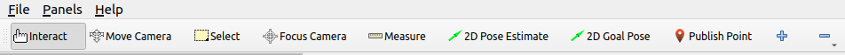

# Usage Guide

When opening a new terminal always ensure that you sourced ROS. 
    ```sh
    source /opt/ros/humble/setup.bash
    ```

Alternatively you can also enable autonomous sourcing on terminal startup, by adding it to your .bashrc file.
    ```sh
    echo "source /opt/ros/humble/setup.bash" >> ~/.bashrc
    ```

Also always source your workspace when using a fresh terminal or after a change of any built pkgs.
    ```sh
    source ~/ros2_ws/install/setup.bash
    ```
## Start-Up
### Starting the simulation

1. Build the packages.
    ```sh
    cd ~/ros2_ws
    colcon build --symlink-install
    ```
2. Source the workspace.
    ```sh
    source install/local_setup.bash
    ```

3. Start the simulation.
    ```sh
    ros2 launch helmoro_sim_bringup helmoro_sim_launch.py
    ```

### Starting the Robot
1. SSH into the robot.
    ```sh
    ssh $(username of robot)@$(ip of robot)
    ```

2. Build the packages.
    ```sh
    cd ~/ros2_ws
    colcon build --symlink-install
    ```

3. Source the workspace.
    ```sh
    source install/local_setup.bash
    ```

4. Start the robot.
    ```sh
    ros2 launch helmoro_real_bringup helmoro_launch.py
    ```

5. For mapping visualization and camera streaming start RVIZ on the computer.
    ```sh
    ros2 launch helmoro_common_bringup rviz_launch.py
    ```

## Controlling the Robot
The robot can be controlled in multiple ways. The way we set it up, is to have operations packages within the folder helmoro_operation that use the topic /cmd_vel as an interface to control HelMoRo. In this example we created two packages. The joy control package and the navigation package. For controlling the robot with a joystick, use the joy control package. For autonomous navigation use the navigation package.

### Joy Control
In the simplest case one can drive Helmoro around using a joystick. In our case we used a Logitech joystick, which we connected to the laptop over Bluetooth. The left 'LT' and right triggers 'LT' accelerate and decellerate in x-direction respectively, and the left digital stick controls the rotation.

For this one needs to just start up either the [simulation](#starting-the-simulation) or the [robot](#starting-the-robot).

Before starting up the joystick make sure that the joystick is connected via the usb receiver to the computer. Also at the backside of the logitech controller you'll find a switch. Shift the switch to 'X' for XInput instead of 'D' for DirectInput such that floating point values will be broadcasted.
Also make sure to press the 'mode'-button such that the LED next to the 'mode'-button lights up. This is necessary for the correct mapping of the inputs. Secondly one needs to actually start the joystick node on the computer which is connected to the same network. Afterwards start the joystick manager.

``` sh
ros2 launch helmoro_joy_control joy_control.launch
```

Press the logitech button to wake up the controller, then press the 'LT' and 'RT' once to fully start the broadcasting of the velocity. To move forward use the 'RT' button while using the 'LT' Button to  move backwards. The left and right buttons on the left most (digital) joystick can be used to control the rotation.

### Autonomous Navigation
HelMoRo is able to navigate in a given space using the ROS Navigation Stack avoiding static and dynamic obstacles. Similarly HelMoRo can also navigate a unknown spaces avoiding static and dynamic obstacles while simulatinously mapping it by inluding the ROS SLAM stack too. In autonomous navigation mode it is possible to steer HelMoRo by sending PoseStamped msgs to the topic /goal_pose. In RVIZ this can be done by using the 2D Goal Pose functionality in the top bar.



Autonomous navigation is included by default in the helmoro simulation and robot startup. If you want to use the navigation pkg without the robot, start it with.

```sh
ros2 launch helmoro_navigation nav_2.launch
```

More information can be found in the chapter [Autonomous Navigation using the Navigation Stack](#autonomous-Navigation-using-the-Navigation-Stack).